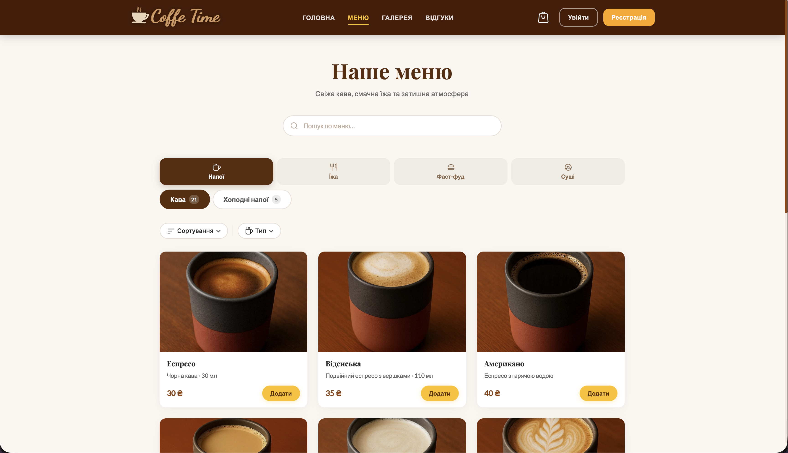
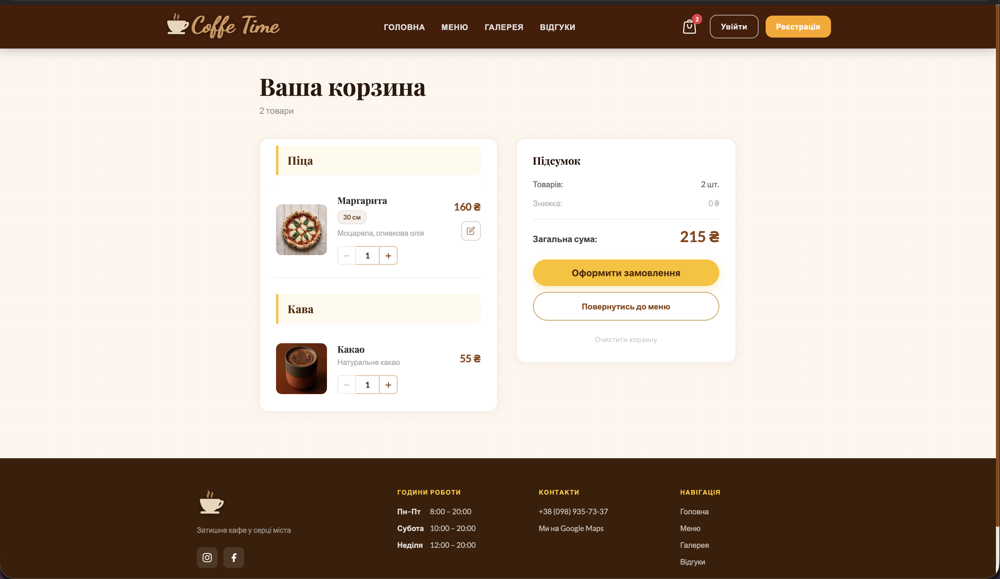
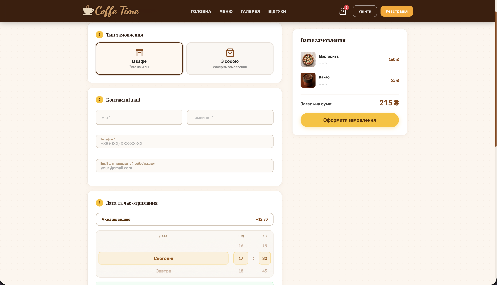
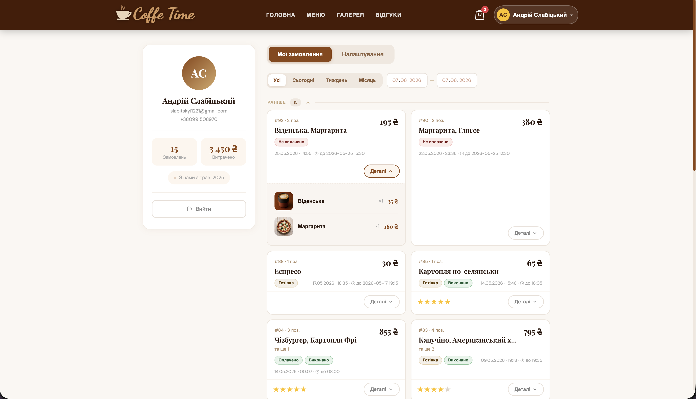
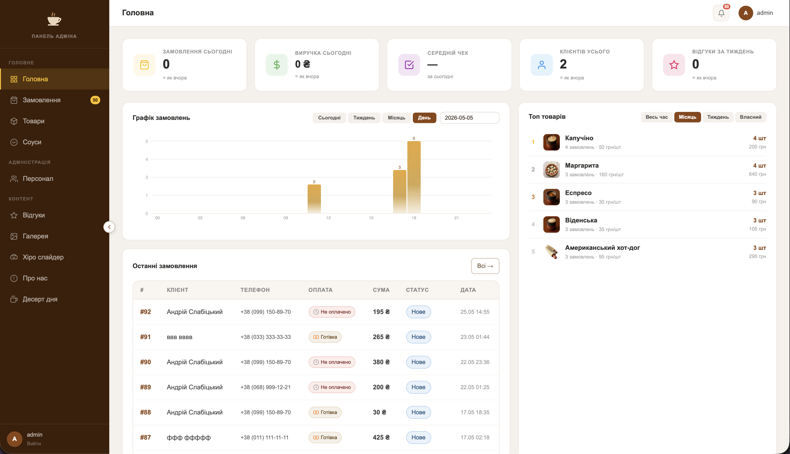

# Coffee Time — онлайн-замовлення для кафе

Повноцінний сайт для кафе **Coffee Time** (м. Гусятин) з меню, онлайн-замовленнями, оплатою та адмін-панеллю.

## Скріншоти

| | |
|---|---|
|  |  |
| **Головна** — hero-слайдер з фото кафе, CTA-кнопка | **Меню** — каталог з пошуком, категоріями та фільтрами |
|  |  |
| **Кошик** — список товарів, зведення замовлення | **Оформлення** — тип доставки, контакти, барабанний picker часу |
|  |  |
| **Профіль** — історія замовлень зі статусами та оцінками | **Адмін** — дашборд зі статистикою, графіком та топ-товарами |

## Стек

| Шар | Технології |
|-----|-----------|
| Frontend | HTML, CSS, Vanilla JS |
| Backend | PHP 8, MySQL |
| Оплата | LiqPay SDK |
| Сповіщення | Telegram Bot API, PHPMailer (Gmail SMTP) |
| Інфраструктура | Docker, Apache |

## Функціонал

- Каталог меню з фільтрацією, пошуком і категоріями
- Кошик із варіантами: розмір піци, борти, соуси, вага торту, морозиво на вагу
- Оформлення замовлення з вибором часу (барабанний picker) та типом оплати
- Онлайн-оплата через LiqPay (з sandbox-режимом)
- Telegram-сповіщення адміністратору при новому замовленні
- Email-нагадування клієнту перед готовністю замовлення
- Авторизація, реєстрація, відновлення паролю
- Профіль користувача з історією замовлень
- Відгуки клієнтів
- Адмін-панель: управління товарами, замовленнями, слайдером, галереєю

## Запуск через Docker

```bash
# 1. Клонувати репозиторій
git clone <repo> coffeetime && cd coffeetime

# 2. Налаштувати змінні середовища
cp .env.example .env
# відредагувати .env (заповнити DB_NAME, DB_USER, DB_PASS, APP_URL тощо)

# 3. Запустити
docker compose up -d --build

# Сайт доступний на http://localhost:8080
# БД імпортується автоматично при першому запуску
```

## Локальний запуск (XAMPP)

```bash
# 1. Клонувати в папку htdocs
git clone <repo> CoffeeTime-release

# 2. Імпортувати БД
mysql -u root CoffeeTime < CoffeeTime.sql

# 3. Налаштувати .env
cp .env.example .env

# 4. Відкрити в браузері
http://localhost/CoffeeTime-release/
```

## Адмін-панель

```
/admin/login.php
```

## Деплой на VPS (GitHub Actions)

При пуші в `main` — автоматичний деплой через SSH.

Потрібно додати в **Settings → Secrets** репозиторію:

| Secret | Опис |
|--------|------|
| `SERVER_HOST` | IP або домен сервера |
| `SERVER_USER` | SSH-користувач (напр. `ubuntu`) |
| `SERVER_SSH_KEY` | Приватний SSH-ключ |

На сервері проєкт повинен лежати в `/var/www/coffeetime` і мати встановлений Docker.

## Змінні середовища

Всі секрети зберігаються в `.env` (не комітиться). Дивись `.env.example`.

```
APP_URL=https://yourdomain.com
DB_NAME=coffeetime
DB_USER=coffeetime
DB_PASS=secret
TELEGRAM_BOT_TOKEN=
LIQPAY_PUBLIC_KEY=
LIQPAY_PRIVATE_KEY=
MAIL_USERNAME=
MAIL_PASSWORD=
```
